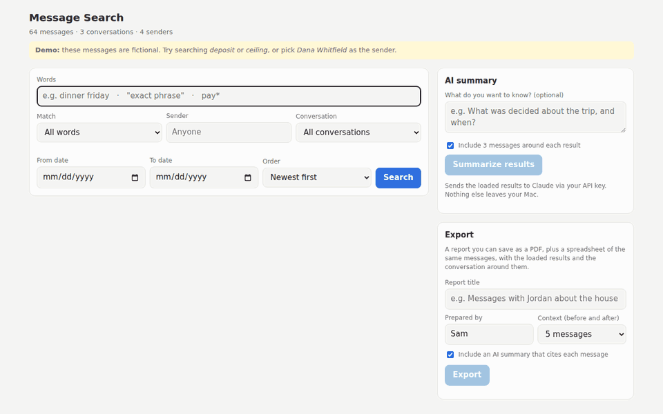
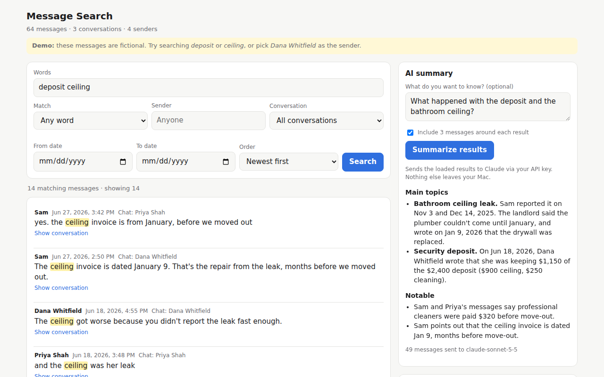
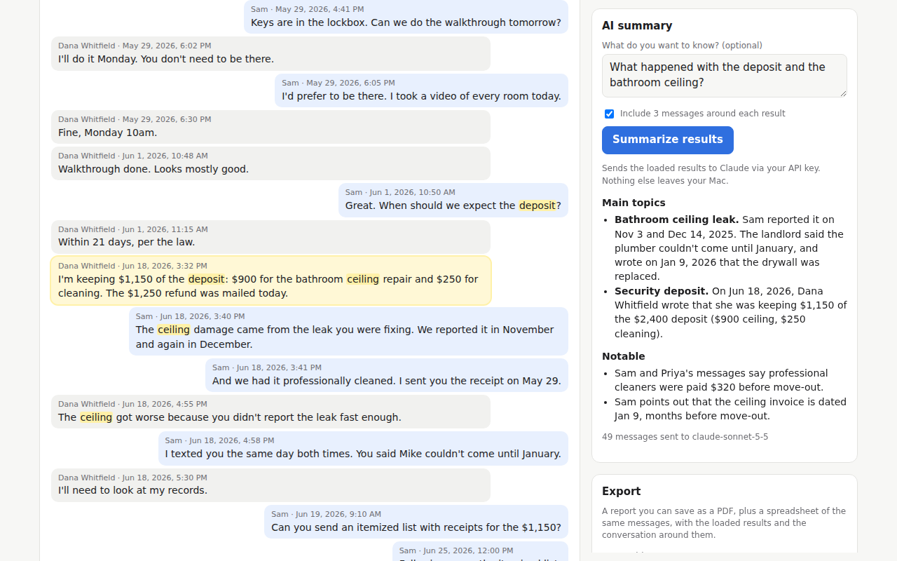
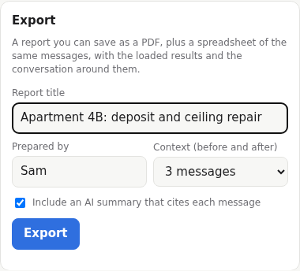
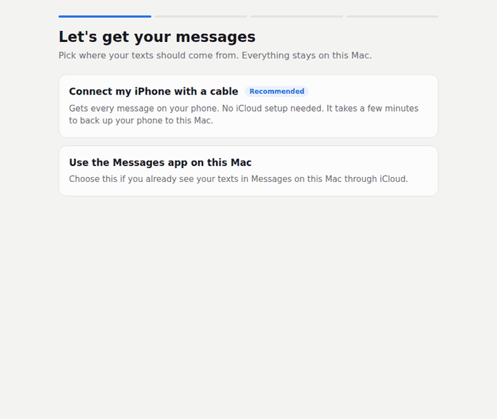

# iMessage Search

Search years of iPhone text messages on your Mac by **who sent them** and **what they say**. Read each result in its conversation, get an **AI summary that cites every message**, and **export a report** you can hand to a lawyer, accountant, or family member.



## Privacy

- **Runs entirely on your Mac.** Your messages are copied into this folder and searched here. They aren't uploaded anywhere.
- **Nothing is uploaded unless you ask for an AI summary.** When you click *Summarize* or export with a summary, only those messages go to Anthropic's API, using your own API key. Without a key, nothing leaves your Mac.
- **Your originals are never changed.** The app reads copies of your Messages database and iPhone backup. Backup passwords aren't saved.
- **Only you can open it.** The app runs at `127.0.0.1` (this Mac only), so other devices on your network can't see it.
- **Your data stays out of git.** `.gitignore` excludes message databases, exports, `.env` (your API key), and personal category files.

## Try it with fictional messages

Double-click **Try the Demo** in the folder. It opens the app with a made-up story about a tenant, a roommate, and a landlord arguing over a security deposit. Try searching *deposit*, or look at the [sample report](docs/sample-report.pdf) it produces. Your own messages aren't read.

| Search and AI summary | Conversation context | Export |
|---|---|---|
|  |  |  |

---

## Getting started

No technical knowledge needed. A setup wizard in your browser walks you through everything.

### 1. Download

On this page, click the green **Code** button, then **Download ZIP**. Open the downloaded file, and move the **imessage-search** folder somewhere you'll find it, such as your Documents folder.

### 2. Double-click **Start iMessage Search**

It's inside the folder. The first time:

- If macOS says it **can't verify the developer**, click **Done**. Then open **System Settings → Privacy & Security**, scroll down, and click **Open Anyway** next to "Start iMessage Search". (On older macOS: right-click the file, choose **Open**, then click **Open**.)
- If it asks to install **Command Line Tools**, click **Install**, wait for it to finish, and double-click **Start iMessage Search** again.

A Terminal window opens. Leave it open while you use the app. Your browser then opens the wizard.

### 3. Follow the wizard



It asks where your messages should come from:

| | **Connect my iPhone with a cable** (recommended) | **Use Messages on this Mac** |
|---|---|---|
| What it gets | Every message on your phone | Whatever Messages in iCloud has synced to this Mac |
| What you do | Plug in the iPhone, unlock it, tap **Trust**, click **Back up now** | Turn on Messages in iCloud (the wizard shows how), then click **Continue** |
| Needs iCloud? | No | Yes |

Along the way the wizard:

- **Asks for permission once.** macOS protects your messages, so you'll switch on access for Terminal in System Settings. The wizard opens the right screen, then restarts itself and picks up where you left off.
- **Finds your iPhone** as soon as it's plugged in.
- **Backs it up** with one click. If the automatic backup doesn't work on your Mac, it shows you how to do it in Finder and notices when that finishes. You can also reuse a recent backup.
- **Asks for your backup password** if your backups are encrypted. The password isn't saved anywhere.
- **Offers AI summaries.** Paste an Anthropic API key to turn them on. This is optional, and you can also add it later on the search page.
- **Builds your search** and opens it when it's done.

### Every time after that

Double-click **Start iMessage Search**. Your browser opens straight to search. To bring in newer messages, click **Update messages** at the top of the search page.

To stop the app, close the Terminal window.

---

## Using search

- **Words:** `dinner friday` finds messages with both words. Switch **Match** to *Any word* or *Exact phrase*. Use `"quoted phrases"` and `pay*` for words that start with "pay". Word endings are matched automatically (`move` also finds `moved` and `moving`).
- **Sender:** start typing a name and pick it. Add more names to include any of them.
- **Conversation** and **date range** narrow things further.
- **Show conversation** under a result opens the messages around it.
- **AI summary:** optionally type a question, then click **Summarize results**. The loaded results go to Claude, plus the 3 messages around each one if that box is checked. The summary cites dates and senders. If the note says results were trimmed, narrow your search.

Summaries use `claude-sonnet-5-5` by default. To change it, set `ANTHROPIC_MODEL` in the `.env` file.

## Exporting a report

After searching, fill in the **Export** panel and click **Export**. A report opens in a new tab. Click **Save as PDF** to keep it, or **Download spreadsheet (CSV)** for the same messages in Excel or Numbers. The report is laid out so someone else, such as a lawyer, can review it:

1. **Cover page:** title, who prepared it and when, how many messages it has, date range, participants, and the search used.
2. **Source and method:** where the messages came from (which iPhone backup, or this Mac's Messages app, and when), a SHA-256 fingerprint of the exact database copy, the time zone, and what's included or left out.
3. **AI summary (optional):** clearly labeled as AI-generated. It has an overview, key points, a timeline, what each person said, and any gaps or ambiguities. Every point cites message numbers like `[M-0012]`, which link to the transcript.
4. **Index of matching messages:** one line each.
5. **Messages:** the full transcript, grouped into excerpts by conversation. Messages that matched the search are highlighted with ★, and the surrounding messages are included for context. Each message shows its reference number, the date and time to the second, the sender, the exact text, and any attachment file names.

The spreadsheet uses the same reference numbers, plus each message's internal ID and GUID from the Messages database, so any line can be traced back to the source.

Use Chrome for page numbers in the PDF. In the print window, turn off "Headers and footers".

---

## How it works

```
iPhone ──cable──▶ Finder backup (~/Library/Application Support/MobileSync/Backup)
   │                  │  Messages database (sms.db) + Contacts, decrypted if needed
   └─iCloud──▶ Messages app (~/Library/Messages/chat.db)
                      │  read-only copy
                      ▼
                 data/chat.db ──imsg.build_index──▶ data/index.sqlite (full-text index)
                                                      │
                          imsg.server: wizard, search page, AI summary (http://127.0.0.1:8765)
                          imsg.categorize: keyword-category review report
```

Local backups always contain the full Messages database, even when Messages in iCloud is on. The app reads copies in `data/` and never changes your Messages app or your backups.

---

## Command-line use (advanced)

Everything the wizard does is also available from Terminal.

```bash
git clone https://github.com/marianina8/imessage-search.git ~/Code/github.com/marianina8/imessage-search
cd ~/Code/github.com/marianina8/imessage-search
python3 -m venv .venv && source .venv/bin/activate
pip install -r requirements.txt

./scripts/copy_messages_db.sh                 # snapshot the Mac's Messages DB into data/
python -m imsg.build_index --me "Alex"        # build data/index.sqlite
python -m imsg.server --open                  # start and open the browser
```

Your terminal app needs **Full Disk Access** (System Settings → Privacy & Security → Full Disk Access). Quit and reopen it after turning that on.

Indexer options:

```bash
python -m imsg.build_index --db path/to/chat.db   # any chat.db or iPhone sms.db copy
python -m imsg.build_index --list-chats           # see conversations and their chat_id
python -m imsg.build_index --chat 5 --chat 12     # index only some conversations
python -m imsg.build_index --no-contacts          # show raw phone numbers/emails
```

If a `contacts.sqlitedb` (iPhone Contacts from a backup) sits next to the database, names are read from it too.

### Keyword-category review

For systematic reviews, such as finding every conversation about a set of topics, define categories of regex patterns with weights, and get a ranked report:

```bash
cp categories.example.json categories.local.json   # edit your topics here (git-ignored)
python -m imsg.categorize --config categories.local.json --chat 5 --min-score 20
```

This writes to `output/`:

| File | Contents |
|---|---|
| `review.md` | Conversations ranked by score, with the matched messages and the full surrounding thread |
| `conversations.csv` | One row per conversation: score, dates, categories, message ID range |
| `hits.csv` | Every individual keyword match |

Scoring: nearby hits whose context windows overlap merge into one conversation. The conversation scores the sum of its category weights. It gets a bonus for covering several categories, extra points for the `combos` you define, and a penalty if it only touches `low_signal_only` categories.

---

## Troubleshooting

| Problem | Fix |
|---|---|
| Double-clicking opens a text editor instead of Terminal | Right-click the file → **Open With → Terminal**. Or run `chmod +x "Start iMessage Search.command"` once in Terminal. |
| The wizard keeps asking for access | Make sure **Terminal** is switched on under **Full Disk Access**. Then quit Terminal (⌘Q) and double-click **Start iMessage Search** again. |
| iPhone not found | Use a data cable, not a charge-only one. Unlock the phone and tap **Trust**. Try another USB port. |
| Automatic backup doesn't finish | Use **Back up with Finder instead** in the wizard. The wizard notices the new backup when Finder is done. |
| "That password didn't unlock the backup" | Use the encrypted-backup password you set in Finder or iTunes, not your Apple Account password. If you forgot it, you can reset it on the iPhone (**Settings → General → Transfer or Reset iPhone → Reset → Reset All Settings**), then make a new backup. |
| Old messages missing (Messages-on-Mac option) | iCloud sync isn't finished yet, or **Keep Messages** was set to 30 days or 1 year at some point. The cable option usually has more history. |
| Names show as phone numbers | That person isn't in your Contacts. |
| Many messages with blank text | Double-click Start again to finish installing helpers (`pytypedstream`). |

## Project layout

```
Start iMessage Search.command   double-click launcher (sets up Python, starts app, opens browser)
Try the Demo.command            same, with fictional demo messages (imsg/demo.py)
scripts/launch.sh               shared launcher logic
imsg/server.py                  local web server: wizard API, search, AI summary
imsg/macos.py                   permissions, iPhone detection, backups, decryption, DB copies
imsg/build_index.py             chat.db/sms.db -> data/index.sqlite (decoding, contacts, FTS5)
imsg/categorize.py              keyword-category scoring and Markdown/CSV report
imsg/report.py                  Export: printable report and CSV
imsg/demo.py                    fictional demo data
web/setup.html                  setup wizard
web/index.html                  search page
scripts/copy_messages_db.sh     command-line snapshot of the Mac's Messages DB
categories.example.json         sample category config
```

Notes for developers: Messages stores dates as nanoseconds since 2001-01-01 UTC. Newer iOS and macOS versions often leave `message.text` empty and put the text in the `attributedBody` blob (an NSAttributedString typedstream), which `build_index.py` decodes. In an unencrypted backup, `sms.db` is stored as `3d/3d0d7e5fb2ce288813306e4d4636395e047a3d28`, and encrypted backups are read with [`iphone_backup_decrypt`](https://github.com/jsharkey13/iphone_backup_decrypt). Automatic backups use Apple's built-in `AppleMobileBackup` tool.

## Credits

iMessage Search is built on these open-source projects:

| Project | Used for | License |
|---|---|---|
| [pytypedstream](https://github.com/dgelessus/python-typedstream) by dgelessus | Decoding message text stored in `attributedBody` | LGPL-3.0-or-later |
| [iphone_backup_decrypt](https://github.com/jsharkey13/iphone_backup_decrypt) by James Sharkey | Reading encrypted iPhone backups | MIT |
| [PyCryptodome](https://www.pycryptodome.org) | Cryptography behind backup decryption | BSD / Public Domain |
| [SQLite](https://sqlite.org) and its FTS5 full-text search | Storage and search | Public Domain |

These are downloaded from PyPI when you first run the app. They aren't copied into this repository, and each keeps its own license. AI summaries use [Claude](https://www.anthropic.com/claude) through the [Anthropic API](https://docs.claude.com), under your own API key and Anthropic's terms.

Apple, iPhone, iMessage, Mac, macOS, and Finder are trademarks of Apple Inc. This project isn't affiliated with or endorsed by Apple or Anthropic.

## Disclaimer

This tool helps you find and organize your own messages. It isn't legal advice, and AI summaries can be wrong, so always check them against the messages they cite. Whether a report is accepted as evidence is up to the court or other body involved. Only use it with messages you have the right to access.

## License

[MIT](LICENSE) © 2026 Marian Montagnino
